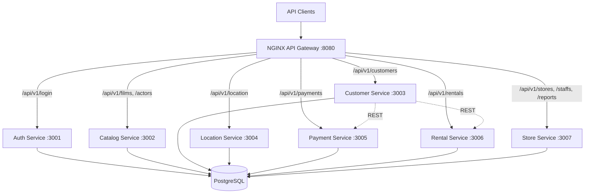
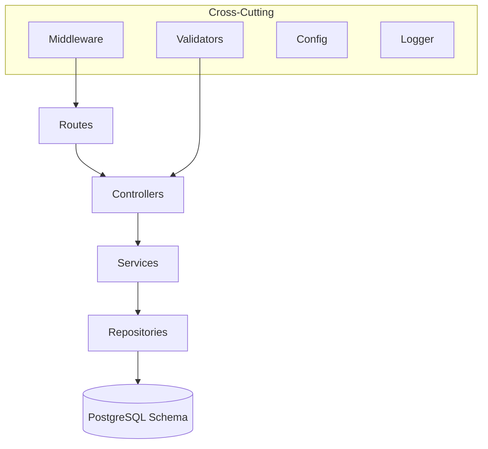
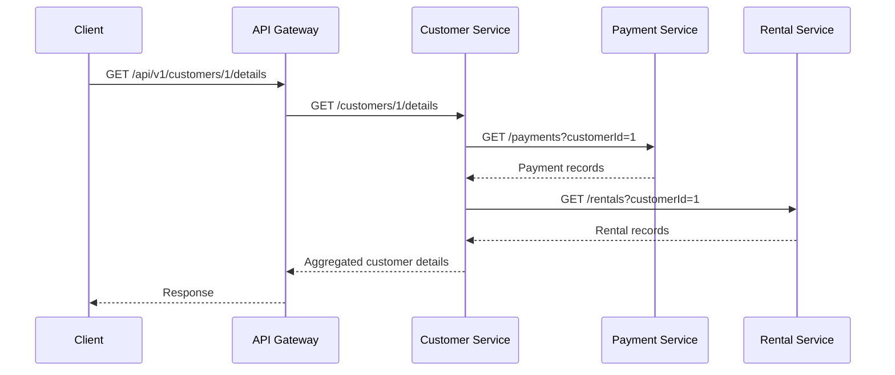
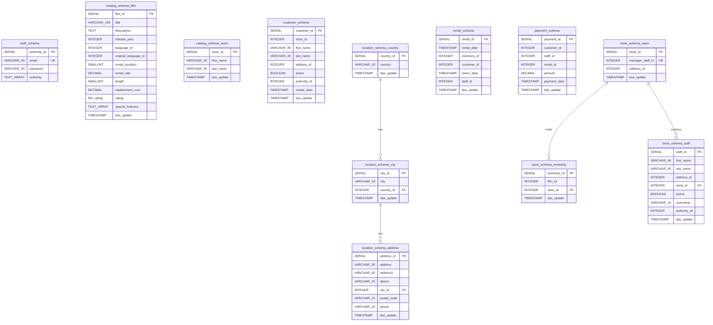

# Design Document: Legacy Modernization

## Overview

This design describes the modernization of the Spring REST Sakila monolith into seven domain-bounded Node.js microservices backed by PostgreSQL. The existing Java 17 Spring Boot 3.0.5 application serves a DVD rental business with 8 service domains (auth, catalog, customer, location, payment, rental, staff, store) over a single MySQL database. The modernization creates a new `sakila-microservices/` workspace at the same level as the monolith, where each service is an independent Node.js/Express project with its own git repository, Dockerfile, and PostgreSQL schema. An NGINX-based API Gateway provides a single entry point, and Docker Compose orchestrates the full stack for local development. The monolith codebase remains completely unmodified.

Key design decisions:
- **Knex.js** as the query builder for database access (lightweight, migration-friendly, good PostgreSQL support)
- **NGINX** as the API Gateway (proven reverse proxy, simple path-based routing, no custom code needed)
- **Joi** for request validation (declarative schema validation, detailed error messages)
- **jsonwebtoken** for JWT handling (standard Node.js JWT library)
- **Jest** as the testing framework with **fast-check** for property-based testing
- **Winston** for structured JSON logging
- **Single PostgreSQL instance** with schema-per-service isolation (simpler for local dev, enforced via database user permissions)

## Architecture

### High-Level Architecture



### Workspace Directory Structure

```
sakila-microservices/
├── api-gateway/
│   ├── nginx.conf
│   ├── Dockerfile
│   └── README.md
├── auth-service/
│   ├── src/
│   │   ├── routes/
│   │   ├── controllers/
│   │   ├── services/
│   │   ├── repositories/
│   │   ├── middleware/
│   │   ├── validators/
│   │   ├── config/
│   │   └── app.js
│   ├── tests/
│   │   ├── unit/
│   │   └── integration/
│   ├── migrations/
│   ├── seeds/
│   ├── Dockerfile
│   ├── .dockerignore
│   ├── .gitignore
│   ├── package.json
│   └── README.md
├── catalog-service/          # Same internal structure
├── customer-service/
├── location-service/
├── payment-service/
├── rental-service/
├── store-service/
├── infrastructure/
│   ├── migrations/
│   │   ├── 001_auth_schema.sql
│   │   ├── 002_catalog_schema.sql
│   │   ├── 003_customer_schema.sql
│   │   ├── 004_location_schema.sql
│   │   ├── 005_payment_schema.sql
│   │   ├── 006_rental_schema.sql
│   │   ├── 007_store_schema.sql
│   │   └── 008_seed_data.sql
│   └── db-init/
│       └── init-schemas.sh
├── docker-compose.yml
├── .github/
│   └── workflows/
│       └── ci.yml
└── README.md
```

### Service Internal Architecture (Layered)

Each microservice follows a consistent layered pattern:



- **Routes**: Express router definitions mapping HTTP methods/paths to controllers
- **Controllers**: Request/response handling, calls validators and services, formats responses
- **Services**: Business logic, orchestrates repository calls and inter-service communication
- **Repositories**: Knex.js query builder calls scoped to the service's schema
- **Middleware**: JWT authentication, correlation ID propagation, request logging, error handling
- **Validators**: Joi schemas for request body/param validation
- **Config**: Environment variable loading with defaults and required-variable checks

## Components and Interfaces

### 1. API Gateway (NGINX)

The API Gateway is a reverse-proxy that routes all external requests to the appropriate microservice based on URL path prefix. It does not perform authentication — that is delegated to each service's JWT middleware.

**Routing Rules:**

| Path Prefix | Target Service | Port |
|---|---|---|
| `/api/v1/login` | auth-service | 3001 |
| `/api/v1/films`, `/api/v1/actors` | catalog-service | 3002 |
| `/api/v1/customers` | customer-service | 3003 |
| `/api/v1/location` | location-service | 3004 |
| `/api/v1/payments` | payment-service | 3005 |
| `/api/v1/rentals` | rental-service | 3006 |
| `/api/v1/stores`, `/api/v1/staffs`, `/api/v1/reports` | store-service | 3007 |

**Error Handling:** Returns HTTP 502 with JSON error body when a target service is unreachable.

### 2. Auth Service

**Responsibility:** User authentication and JWT token issuance.

**Endpoints:**
- `POST /login` — Validates email/password against the `authority` table, returns signed JWT in `Authorization` header

**JWT Payload:**
```json
{
  "sub": "user@example.com",
  "roles": ["ROLE_READ", "ROLE_MANAGE"],
  "iat": 1700000000,
  "exp": 1700003600
}
```

**Shared JWT Middleware (used by all services):**
Each service includes a `jwtAuth` middleware that:
1. Extracts the Bearer token from the `Authorization` header
2. Verifies signature and expiration using the shared `JWT_SECRET`
3. Attaches decoded user info to `req.user`
4. Returns 401 if token is missing/invalid, 403 if role is insufficient

**Role-checking middleware factory:**
```javascript
const requireRole = (...roles) => (req, res, next) => {
  if (!roles.some(role => req.user.roles.includes(role))) {
    return res.status(403).json({ error: { code: 'FORBIDDEN', message: 'Insufficient permissions' } });
  }
  next();
};
```

### 3. Catalog Service

**Responsibility:** Film, actor, category, and language management.

**Database Schema:** `catalog_schema` — owns `actor`, `film`, `film_actor`, `film_category`, `film_text`, `category`, `language` tables.

**Endpoints:**
- Films: `GET /films`, `POST /films`, `GET /films/:filmId`, `PUT /films/:filmId`, `DELETE /films/:filmId`, `GET /films/:filmId/actors`, `GET /films/:filmId/actors/:actorId`, `GET /films/:filmId/details`
- Actors: `GET /actors`, `POST /actors`, `GET /actors/:actorId`, `PUT /actors/:actorId`, `DELETE /actors/:actorId`, `GET /actors/:actorId/details`, `GET /actors/:actorId/films`, `POST /actors/:actorId/films`, `DELETE /actors/:actorId/films/:filmId`, `POST /actors/search`

**Authorization:** ROLE_READ for GET endpoints, ROLE_MANAGE for POST/PUT/DELETE.

**Key Logic:**
- Film filtering by category, release year, and rating via query parameters
- Actor search by partial name match (first or last name)
- Film text full-text search via PostgreSQL `tsvector` index
- Pagination via `page`, `size`, `sort` query parameters

### 4. Customer Service

**Responsibility:** Customer account management and cross-service aggregation of customer history.

**Database Schema:** `customer_schema` — owns `customer` table. References `store_id`, `address_id`, `authority_id` as unconstrained integer columns.

**Endpoints:**
- `GET /customers`, `POST /customers`, `GET /customers/:customerId`, `PUT /customers/:customerId`, `DELETE /customers/:customerId`, `GET /customers/:customerId/details`

**Inter-Service Communication:**
- Calls Payment Service `GET /payments?customerId=X` for customer payment history
- Calls Rental Service `GET /rentals?customerId=X` for customer rental history

**Authorization:** ROLE_MANAGE for all endpoints.

### 5. Location Service

**Responsibility:** Geographic reference data (countries, cities, addresses).

**Database Schema:** `location_schema` — owns `country`, `city`, `address` tables.

**Endpoints:**
- Addresses: `GET /location/addresses`, `POST /location/addresses`, `GET /location/addresses/:addressId`, `PUT /location/addresses/:addressId`, `DELETE /location/addresses/:addressId`, `GET /location/addresses/:addressId/details`
- Cities: `GET /location/cities`, `POST /location/cities`, `GET /location/cities/:cityId`, `PUT /location/cities/:cityId`, `DELETE /location/cities/:cityId`

**Authorization:** ROLE_READ for GET, ROLE_MANAGE for POST/PUT/DELETE.

### 6. Payment Service

**Responsibility:** Payment record management.

**Database Schema:** `payment_schema` — owns `payment` table. References `customer_id`, `staff_id`, `rental_id` as unconstrained integer columns.

**Endpoints:**
- `GET /payments`, `GET /payments/:paymentId`, `PUT /payments/:paymentId`, `DELETE /payments/:paymentId`, `GET /payments/:paymentId/details`

**Authorization:** ROLE_MANAGE for all endpoints.

### 7. Rental Service

**Responsibility:** DVD rental and return operations.

**Database Schema:** `rental_schema` — owns `rental` table. References `inventory_id`, `customer_id`, `staff_id` as unconstrained integer columns.

**Endpoints:**
- `GET /rentals`, `POST /rentals`, `GET /rentals/:rentalId`, `PUT /rentals/:rentalId`, `DELETE /rentals/:rentalId`, `PUT /rentals/return`

**Key Logic:**
- Rental date defaults to `now()` if not provided
- Return date is nullable (null = still rented)
- `PUT /rentals/return` sets the return_date on an existing rental

**Authorization:** ROLE_MANAGE for all endpoints.

### 8. Store Service

**Responsibility:** Store management, inventory, staff assignment, and sales reporting.

**Database Schema:** `store_schema` — owns `store`, `inventory`, `staff` tables. References `address_id`, `film_id` as unconstrained integer columns.

**Endpoints:**
- Stores: `GET /stores`, `POST /stores`, `GET /stores/:storeId`, `PUT /stores/:storeId`, `DELETE /stores/:storeId`, `GET /stores/:storeId/details`, `GET /stores/:storeId/staffs`, `GET /stores/:storeId/staffs/:staffId`, `POST /stores/:storeId/staffs/:staffId`, `PUT /stores/:storeId/staffs/:staffId`, `DELETE /stores/:storeId/staffs/:staffId`
- Staff: `GET /staffs`, `POST /staffs`, `GET /staffs/:staffId`, `PUT /staffs/:staffId`, `DELETE /staffs/:staffId`, `GET /staffs/:staffId/details`
- Reports: `GET /reports/sales/categories`, `GET /reports/sales/stores`

**Authorization:** ROLE_MANAGE for read endpoints, ROLE_ADMIN for create/update/delete on stores and staff.

**Key Logic:**
- Staff and store are co-located in the same service due to their circular dependency (store references manager_staff_id, staff references store_id)
- Sales reports aggregate data across inventory, rental, and payment via cross-schema views or inter-service calls
- Each store has exactly one manager (unique constraint on manager_staff_id)

### 9. Cross-Service Communication

All inter-service calls use synchronous HTTP REST with the following conventions:

- **Base URLs** configured via environment variables (e.g., `PAYMENT_SERVICE_URL=http://payment-service:3005`)
- **Correlation ID** propagated via `X-Correlation-ID` header on all outgoing requests
- **JWT forwarding**: The calling service forwards the original JWT token to downstream services
- **Timeout**: 5-second default timeout on all inter-service HTTP calls
- **Error handling**: If a downstream service returns an error or is unreachable, the calling service returns HTTP 503 with a descriptive message



## Data Models

### Database Strategy

A single PostgreSQL instance hosts all schemas, with schema-per-service isolation enforced by dedicated database users. Each user has `USAGE` and full DML privileges on its own schema only.



### MySQL to PostgreSQL Type Mapping

| MySQL Type | PostgreSQL Type | Notes |
|---|---|---|
| `SMALLINT UNSIGNED AUTO_INCREMENT` | `SERIAL` (or `SMALLSERIAL`) | PostgreSQL has no unsigned integers; SERIAL provides auto-increment |
| `TINYINT UNSIGNED AUTO_INCREMENT` | `SMALLSERIAL` | Smallest auto-increment in PostgreSQL |
| `MEDIUMINT UNSIGNED AUTO_INCREMENT` | `SERIAL` | Maps to 4-byte integer with sequence |
| `INT AUTO_INCREMENT` | `SERIAL` | Standard auto-increment |
| `TINYINT UNSIGNED` | `SMALLINT` | Smallest integer type in PostgreSQL |
| `SMALLINT UNSIGNED` | `INTEGER` | Upgrade to avoid overflow from unsigned range |
| `MEDIUMINT UNSIGNED` | `INTEGER` | No MEDIUMINT in PostgreSQL |
| `ENUM('G','PG','PG-13','R','NC-17')` | `CREATE TYPE film_rating AS ENUM(...)` | PostgreSQL custom ENUM type |
| `SET('ROLE_READ',...)` | `TEXT[]` | PostgreSQL array type for multi-value sets |
| `SET('Trailers',...)` | `TEXT[]` | PostgreSQL array type |
| `TIMESTAMP ... ON UPDATE CURRENT_TIMESTAMP` | `TIMESTAMP` + trigger | PostgreSQL trigger for auto-update |
| `DATETIME` | `TIMESTAMP` | PostgreSQL TIMESTAMP covers both |
| `YEAR` | `INTEGER` | No YEAR type in PostgreSQL |
| `BLOB` | `BYTEA` | Binary data |
| `FULLTEXT INDEX` | `tsvector` + `GIN INDEX` | PostgreSQL full-text search |
| `BOOLEAN` | `BOOLEAN` | Direct mapping |
| `DECIMAL(p,s)` | `NUMERIC(p,s)` | Direct mapping |

### Cross-Schema References

When a table references an entity in a different bounded context, the foreign key constraint is removed and replaced with an unconstrained integer column. Data integrity for cross-schema references is maintained at the application level.

| Service | Column | References (Logical) | Constraint |
|---|---|---|---|
| customer_schema.customer | store_id | store_schema.store | None (integer only) |
| customer_schema.customer | address_id | location_schema.address | None (integer only) |
| customer_schema.customer | authority_id | auth_schema.authority | None (integer only) |
| rental_schema.rental | inventory_id | store_schema.inventory | None (integer only) |
| rental_schema.rental | customer_id | customer_schema.customer | None (integer only) |
| rental_schema.rental | staff_id | store_schema.staff | None (integer only) |
| payment_schema.payment | customer_id | customer_schema.customer | None (integer only) |
| payment_schema.payment | staff_id | store_schema.staff | None (integer only) |
| payment_schema.payment | rental_id | rental_schema.rental | None (integer only) |
| store_schema.store | address_id | location_schema.address | None (integer only) |
| store_schema.inventory | film_id | catalog_schema.film | None (integer only) |
| store_schema.staff | address_id | location_schema.address | None (integer only) |
| store_schema.staff | authority_id | auth_schema.authority | None (integer only) |

### PostgreSQL Stored Procedures and Functions

The following MySQL stored procedures/functions are converted to PostgreSQL equivalents within the appropriate schema:

| MySQL Object | PostgreSQL Equivalent | Target Schema |
|---|---|---|
| `get_customer_balance()` | `customer_schema.get_customer_balance()` | customer_schema (requires cross-schema read access to rental and payment data via service calls or materialized view) |
| `inventory_in_stock()` | `store_schema.inventory_in_stock()` | store_schema |
| `inventory_held_by_customer()` | `store_schema.inventory_held_by_customer()` | store_schema |
| `film_in_stock()` | `store_schema.film_in_stock()` | store_schema |
| `film_not_in_stock()` | `store_schema.film_not_in_stock()` | store_schema |
| `rewards_report()` | Implemented as a service-layer function | customer_schema (aggregates across services) |

### PostgreSQL Views

| MySQL View | PostgreSQL Equivalent | Target Schema |
|---|---|---|
| `customer_list` | `customer_schema.customer_list` | customer_schema (joins with location data via materialized snapshot or service call) |
| `film_list` | `catalog_schema.film_list` | catalog_schema (self-contained) |
| `staff_list` | `store_schema.staff_list` | store_schema (joins with location data via materialized snapshot) |
| `sales_by_store` | `store_schema.sales_by_store` | store_schema (implemented as service-layer aggregation) |
| `sales_by_film_category` | `catalog_schema.sales_by_film_category` | Implemented as service-layer aggregation across catalog, store, rental, and payment |

### Auto-Update Trigger

Each table with a `last_update` column gets a PostgreSQL trigger to replicate MySQL's `ON UPDATE CURRENT_TIMESTAMP`:

```sql
CREATE OR REPLACE FUNCTION update_last_update_column()
RETURNS TRIGGER AS $$
BEGIN
    NEW.last_update = CURRENT_TIMESTAMP;
    RETURN NEW;
END;
$$ LANGUAGE plpgsql;

-- Applied per table:
CREATE TRIGGER set_last_update
    BEFORE UPDATE ON catalog_schema.actor
    FOR EACH ROW
    EXECUTE FUNCTION update_last_update_column();
```

## Correctness Properties

*A property is a characteristic or behavior that should hold true across all valid executions of a system — essentially, a formal statement about what the system should do. Properties serve as the bridge between human-readable specifications and machine-verifiable correctness guarantees.*

### Property 1: JWT Authentication Round Trip

*For any* valid authority record (email, password, roles), authenticating via `POST /login` with the correct credentials and then decoding the returned JWT should yield a token containing the same email and the same set of roles.

**Validates: Requirements 2.3, 6.1, 6.2**

### Property 2: JWT Validation Rejects Invalid Tokens

*For any* randomly generated string that is not a validly signed JWT (including expired tokens, tokens with tampered signatures, and empty strings), the JWT authentication middleware should reject the request and return HTTP 401.

**Validates: Requirements 6.3, 6.4**

### Property 3: Role-Based Access Control Enforcement

*For any* protected endpoint and any valid JWT token whose roles do not include the required role for that endpoint, the service should return HTTP 403.

**Validates: Requirements 6.5**

### Property 4: Pagination Consistency

*For any* paginated list endpoint, given a dataset of N records, requesting page P of size S should return at most S records, and iterating through all pages should yield exactly N total records with no duplicates and no omissions.

**Validates: Requirements 3.5**

### Property 5: Downstream Service Unavailability Returns 503

*For any* inter-service communication call where the downstream service is unreachable (connection refused or timeout), the calling service should return HTTP 503 with a JSON error body containing the standard error format.

**Validates: Requirements 5.5**

### Property 6: API Gateway Returns 502 When Target Unreachable

*For any* request routed through the API Gateway where the target microservice is unreachable, the gateway should return HTTP 502 with a descriptive error message.

**Validates: Requirements 9.8**

### Property 7: Correlation ID Propagation

*For any* incoming request with an `X-Correlation-ID` header, all outgoing inter-service HTTP calls made during that request's processing should include the same `X-Correlation-ID` value. If no correlation ID is provided, the service should generate one and propagate it.

**Validates: Requirements 5.6, 10.5**

### Property 8: Auto-Increment to SERIAL Conversion

*For any* table in the MySQL Sakila schema that uses `AUTO_INCREMENT`, the corresponding PostgreSQL migration script should define that column using `SERIAL`, `SMALLSERIAL`, or `BIGSERIAL`, and inserting a new row without specifying the ID should auto-generate a sequential ID.

**Validates: Requirements 7.2**

### Property 9: Last Update Trigger Auto-Updates Timestamp

*For any* table with a `last_update` column in the PostgreSQL schema, updating any column in a row should automatically set `last_update` to the current timestamp, and the new `last_update` value should be greater than or equal to the previous value.

**Validates: Requirements 7.5**

### Property 10: Cross-Schema Foreign Key Removal

*For any* foreign key in the MySQL Sakila schema that references a table belonging to a different bounded context, the corresponding PostgreSQL schema should contain the reference column as a plain integer with no foreign key constraint.

**Validates: Requirements 7.8**

### Property 11: Data Migration Integrity

*For any* record in the MySQL Sakila database, after running the migration scripts, the corresponding record should exist in the appropriate PostgreSQL domain schema with equivalent field values (accounting for type conversions).

**Validates: Requirements 7.12**

### Property 12: Database Schema Isolation

*For any* microservice's database user, attempting to SELECT, INSERT, UPDATE, or DELETE on a table in another service's schema should result in a permission denied error.

**Validates: Requirements 8.1, 8.2, 8.4**

### Property 13: Health Endpoint Response Format

*For any* running microservice, `GET /health` should return HTTP 200 with a JSON body containing at minimum `name` (string), `status` (string), and `uptime` (number) fields.

**Validates: Requirements 10.1**

### Property 14: Readiness Endpoint Reflects Database Connectivity

*For any* microservice, `GET /health/ready` should return HTTP 200 when the database connection is healthy, and HTTP 503 when the database connection is unavailable.

**Validates: Requirements 10.2, 10.3**

### Property 15: Structured Request Logging

*For any* incoming HTTP request to any microservice, the service should produce a structured JSON log entry containing `timestamp`, `method`, `path`, `statusCode`, and `responseTime` fields.

**Validates: Requirements 10.4**

### Property 16: Consistent Error Response Format

*For any* error response (4xx or 5xx) from any microservice, the JSON body should conform to the format `{ "error": { "code": string, "message": string, "details": array, "timestamp": string } }`.

**Validates: Requirements 15.1, 15.2, 15.3, 15.4**

### Property 17: Downstream Error Propagation

*For any* inter-service call that returns an HTTP error status, the calling service should propagate an appropriate HTTP error status to the original caller (not swallow the error or return 200).

**Validates: Requirements 15.5**

### Property 18: Input Validation Rejects Invalid Data

*For any* request body where at least one field violates a validation rule (missing required field, string exceeding max length, numeric value out of range, or invalid enum value), the service should return HTTP 400 with a JSON body listing all validation errors for that request.

**Validates: Requirements 18.1, 18.2, 18.3, 18.4, 18.5**

### Property 19: Configuration Read From Environment Variables

*For any* supported configuration variable (DATABASE_URL, JWT_SECRET, PORT, LOG_LEVEL, service URLs), the microservice should use the value from the corresponding environment variable when it is set.

**Validates: Requirements 3.6, 19.1, 19.2**

### Property 20: Default Values for Optional Configuration

*For any* optional configuration variable (PORT, LOG_LEVEL) that is not set in the environment, the microservice should use the documented default value (PORT=3000, LOG_LEVEL=info).

**Validates: Requirements 19.3**

### Property 21: Missing Required Configuration Causes Startup Failure

*For any* required configuration variable (DATABASE_URL, JWT_SECRET) that is absent from the environment, the microservice should log an error identifying the missing variable and exit with a non-zero exit code.

**Validates: Requirements 19.4**

## Error Handling

### Consistent Error Response Format

All microservices use a shared error response format:

```json
{
  "error": {
    "code": "RESOURCE_NOT_FOUND",
    "message": "Film with id 9999 not found",
    "details": [],
    "timestamp": "2026-03-05T12:00:00.000Z"
  }
}
```

### Error Codes

| HTTP Status | Error Code | When Used |
|---|---|---|
| 400 | `VALIDATION_ERROR` | Request body fails Joi validation |
| 401 | `UNAUTHORIZED` | Missing or invalid JWT token |
| 403 | `FORBIDDEN` | Valid JWT but insufficient role |
| 404 | `RESOURCE_NOT_FOUND` | Requested entity does not exist |
| 500 | `INTERNAL_ERROR` | Unexpected server error (no internal details exposed) |
| 502 | `BAD_GATEWAY` | API Gateway cannot reach target service |
| 503 | `SERVICE_UNAVAILABLE` | Downstream service unreachable during inter-service call |

### Validation Error Details

When validation fails, the `details` array contains field-level errors:

```json
{
  "error": {
    "code": "VALIDATION_ERROR",
    "message": "Request validation failed",
    "details": [
      { "field": "title", "message": "\"title\" is required" },
      { "field": "rental_rate", "message": "\"rental_rate\" must be a positive number" }
    ],
    "timestamp": "2026-03-05T12:00:00.000Z"
  }
}
```

### Error Handling Middleware

Each service uses a centralized Express error-handling middleware as the last middleware in the chain:

```javascript
const errorHandler = (err, req, res, next) => {
  const statusCode = err.statusCode || 500;
  const errorResponse = {
    error: {
      code: err.code || 'INTERNAL_ERROR',
      message: statusCode === 500 ? 'An unexpected error occurred' : err.message,
      details: err.details || [],
      timestamp: new Date().toISOString()
    }
  };
  logger.error({ err, correlationId: req.correlationId, path: req.path });
  res.status(statusCode).json(errorResponse);
};
```

### Inter-Service Error Handling

When a service makes an HTTP call to another service and receives an error:
- **Connection refused / timeout**: Return 503 `SERVICE_UNAVAILABLE`
- **4xx from downstream**: Evaluate and propagate appropriate status (e.g., downstream 404 may become caller's 404 or 500 depending on context)
- **5xx from downstream**: Return 503 `SERVICE_UNAVAILABLE` to the original caller

### 500 Error Safety

The error handler never exposes stack traces, internal error messages, or database error details in 500 responses. All unexpected errors are logged server-side with full details but return only a generic message to the client.

## Testing Strategy

### Testing Framework and Libraries

| Tool | Purpose |
|---|---|
| **Jest** | Unit and integration test runner |
| **fast-check** | Property-based testing library |
| **supertest** | HTTP assertion library for integration tests |
| **nock** | HTTP mocking for inter-service call tests |
| **testcontainers** | Spin up real PostgreSQL for integration tests |

### Dual Testing Approach

Both unit tests and property-based tests are required for comprehensive coverage:

- **Unit tests** verify specific examples, edge cases, and error conditions
- **Property-based tests** verify universal properties across randomly generated inputs
- Together they provide both concrete bug detection and general correctness guarantees

### Unit Testing

Each microservice targets 80% line coverage on service-layer modules.

Unit tests focus on:
- Service-layer business logic (success and error paths)
- Validation schema correctness (Joi schemas accept valid input, reject invalid input)
- JWT middleware behavior (valid tokens, expired tokens, missing tokens, wrong roles)
- Error handler formatting
- Configuration loading (defaults, required variables, env var overrides)
- Data transformation logic (request DTO to DB model, DB model to response DTO)

Unit tests mock:
- Database calls (Knex.js query builder mocked)
- Inter-service HTTP calls (nock or manual mocks)
- External dependencies (logger, etc.)

### Property-Based Testing

Each correctness property from the design document is implemented as a single property-based test using fast-check. Each test runs a minimum of 100 iterations.

Each property test is tagged with a comment referencing the design property:

```javascript
// Feature: legacy-modernization, Property 2: JWT Validation Rejects Invalid Tokens
test('rejects any non-valid JWT string', () => {
  fc.assert(
    fc.property(fc.string(), (randomString) => {
      const result = validateJwt(randomString);
      expect(result.valid).toBe(false);
    }),
    { numRuns: 100 }
  );
});
```

Property tests cover:
- **Property 1**: JWT round trip (authenticate → decode → verify email and roles match)
- **Property 2**: JWT rejection (random strings are never accepted as valid tokens)
- **Property 3**: RBAC enforcement (tokens without required role get 403)
- **Property 4**: Pagination consistency (all pages together yield complete dataset)
- **Property 5**: Downstream unavailability → 503
- **Property 6**: Gateway unavailability → 502
- **Property 7**: Correlation ID propagation
- **Property 8**: AUTO_INCREMENT → SERIAL conversion
- **Property 9**: last_update trigger auto-updates
- **Property 10**: Cross-schema FK removal
- **Property 11**: Data migration integrity
- **Property 12**: Schema isolation (permission denied on cross-schema access)
- **Property 13**: Health endpoint format
- **Property 14**: Readiness reflects DB state
- **Property 15**: Structured request logging
- **Property 16**: Error response format consistency
- **Property 17**: Downstream error propagation
- **Property 18**: Input validation rejects invalid data
- **Property 19**: Config from env vars
- **Property 20**: Default config values
- **Property 21**: Missing required config → exit

### Integration Testing

Integration tests run against a real PostgreSQL instance (via testcontainers or Docker Compose test profile):

- CRUD endpoint tests for all services (correct status codes, response structure, DB state changes)
- Pagination, filtering, and sorting behavior
- Authentication and authorization enforcement (401/403 scenarios)
- Inter-service communication with mocked downstream services (via nock)
- Database migration script verification (schemas created, data migrated)
- Health and readiness endpoint behavior under normal and degraded conditions

Test database is seeded with known test data before each suite and cleaned after.

### Test Organization

```
<service>/
├── tests/
│   ├── unit/
│   │   ├── services/
│   │   │   └── *.test.js
│   │   ├── middleware/
│   │   │   └── *.test.js
│   │   ├── validators/
│   │   │   └── *.test.js
│   │   └── config/
│   │       └── *.test.js
│   ├── integration/
│   │   ├── routes/
│   │   │   └── *.test.js
│   │   └── setup.js
│   └── properties/
│       └── *.property.test.js
├── jest.config.js
└── package.json
```

### CI Integration

- Unit tests and property tests run on every push to main and on every PR
- Integration tests run in CI with a PostgreSQL service container
- Coverage reports generated by Jest and enforced at 80% threshold
- Property tests run with 100 iterations in CI (can be increased for nightly runs)
